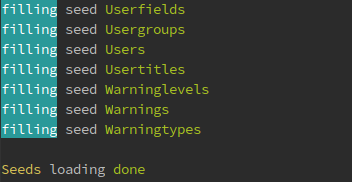
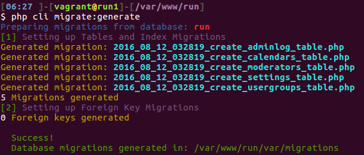
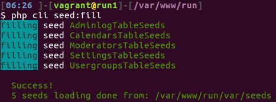

[![Latest Version on Packagist][ico-version]][link-packagist] [![Software License][ico-license]][link-license] [![Total Downloads][ico-downloads]][link-downloads]
#RunCli
Command Line Interface.
    `migrate, seed, generate Eloquent ORM migrations from existing database, generate resources`
    
## Install
Via Composer, command line

``` bash
$ composer require runcmf/runcli
```
Via composer.json
```
...
"require": {
    "runcmf/runcli":  "dev-master"
  },
...
```
``` bash
$ composer update
```

# Usage:
## Seed & Migrate
``` bash
php cli - for help
php cli make:seed vendor/runcmf/runbb
php cli make:migrate vendor/runcmf/runbb
```



## Generate migration from existing database:
> redone from [Xethron](https://github.com/Xethron/migrations-generator) but without Laravel, way/generators and doctrine/dbal 

``` bash
php cli make:generate -h
php cli make:generate
```

####*Generator info:*
> tested only MyISAM on mysqlnd 5.0.12-dev and as result: **NOT ready Foreign Keys**

####Know bug:
```sql
`regip` varbinary(16) NOT NULL DEFAULT '',
`lastip` varbinary(16) NOT NULL DEFAULT '',
```
migrated to
```php
$table->binary('regip', 16)->default('')->index('regip');
$table->binary('lastip', 16)->default('')->index('lastip');
```
with migrate exception:
```bash
[Illuminate\Database\QueryException]                                                                                                                                                        
  SQLSTATE[42000]: Syntax error or access violation: 1170 BLOB/TEXT column 'regip' used in key specification without a key length (SQL: alter table `mybb_users` add index `regip`(`regip`))
```
solution 1:
```php
$table->binary('regip', 16)->default('');//->index('regip');
$table->binary('lastip', 16)->default('');//->index('lastip');

add in up section
DB::statement('CREATE INDEX regip_idx ON '.DB::getTablePrefix().'users (regip(16));');
DB::statement('CREATE INDEX lastip_idx ON '.DB::getTablePrefix().'users (lastip(16));');

add in down section
DB::schema()->table('users', function($table) {
  $table->dropIndex('regip_idx');
});
DB::schema()->table('users', function($table) {
  $table->dropIndex('lastip_idx');
});
```
solution 2:
use [Eloquent ORM ipAddress](https://laravel.com/docs/master/migrations)
```php
$table->ipAddress('visitor');
```
solution 3:
http://stackoverflow.com/questions/17795517/laravel-4-saving-ip-address-to-model

and so on :)


### Who do I talk to? ###

* 1f7.wizard ( at ) gmail.com
* http://runcmf.ru

## License

Apache License
Version 2.0. Please see [License File](LICENSE.md) for more information.

[ico-version]: https://img.shields.io/packagist/v/runcmf/runcli.svg?style=flat-square
[ico-license]: https://img.shields.io/badge/license-Apache%202-green.svg?style=flat-square
[ico-downloads]: https://img.shields.io/packagist/dt/runcmf/runcli.svg?style=flat-square

[link-packagist]: https://packagist.org/packages/runcmf/runcli
[link-license]: http://www.apache.org/licenses/LICENSE-2.0
[link-downloads]: https://bitbucket.org/1f7/runcli
