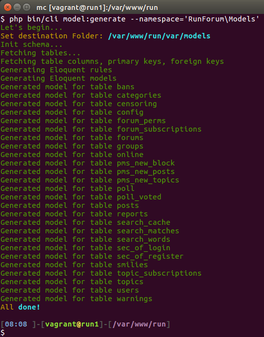

[](https://travis-ci.org/runcmf/runcli)
[](https://coveralls.io/github/runcmf/runcli?branch=master)
[](https://codeclimate.com/github/runcmf/runcli)
[![Latest Version on Packagist][ico-version]][link-packagist]
[![Total Downloads][ico-downloads]][link-downloads]
[![Software License][ico-license]][link-license]

#RunCli
##Standalone command line interface.  

`migrate, seed, generate migrations, models and seeds from existing database, generate resources, create database`  

supported driver `mysql, pgsql, sqlite`  
    
``` bash
$ mysql -V
mysql  Ver 15.1 Distrib 10.1.16-MariaDB, for debian-linux-gnu (x86_64) using readline 5.2

$ psql --version
psql (PostgreSQL) 9.4.9

$ sqlite3
SQLite version 3.8.2 2013-12-06 14:53:30
```
  
main objective was generate [Eloquent ORM](https://github.com/illuminate/database) migrations from existing database outside [Laravel](https://github.com/laravel/laravel) 
in my case [Eloquent ORM](https://github.com/illuminate/database) used with [Slim 3 Framework](https://github.com/slimphp/Slim)
  
  
## Install
``` bash
$ composer require runcmf/runcli
```

* copy or `ln -s` cli to scripts_root/bin

#Config:
script looking config in paths:  
app/Config/Settings.php [runcmf/runcmf-skeleton](https://bitbucket.org/1f7/runcmf-skeleton.git)  
app/settings.php [akrabat/slim3-skeleton](https://github.com/akrabat/slim3-skeleton)  

config must contain ['settings']['db'] section.
for example:
``` php
defined('DS') || define('DS', DIRECTORY_SEPARATOR);
define('DIR', realpath(__DIR__.'/../../') .DS);

return [
  'settings' => [
    'displayErrorDetails' => true,
    'determineRouteBeforeAppMiddleware' => true,
    'addContentLengthHeader' => false,
    'routerCacheFile' => DIR . 'var/cache/fastroute.cache',
    'db' => [// database configuration
      'default' => 'sqlite',
      'connections' => [
        'sqlite' => [
          'driver'   => 'sqlite',
          'database' => DIR . 'var/database/database.sqlite',
          'prefix'   => 'mybb_',
        ],
        'mysql' => [
          'driver'    => 'mysql',
//          'engine'    => 'MyISAM',
          'engine'    => 'InnoDB',
          'host'      => '127.0.0.1',
          'database'  => 'run',
          'username'  => 'dbuser',
          'password'  => '123',
          'charset'   => 'utf8',
          'collation' => 'utf8_unicode_ci',
          'prefix'    => 'mybb_',
        ],
        'pgsql' => [
          'driver'   => 'pgsql',
          'host'     => '127.0.0.1',
          'database' => 'run',
          'username' => 'dbuser',
          'password' => '123',
          'charset'  => 'utf8',
          'prefix'   => 'mybb_',
          'schema'   => 'public',
        ],
        'sqlsrv' => [
          'driver'   => 'sqlsrv',
          'host'     => '127.0.0.1',
          'database' => 'run',
          'username' => 'dbuser',
          'password' => '123',
          'prefix'   => '',
        ],
      ],
    ],
    ...
    ...
    ...
```

# Usage:
## Seed & Migrate
``` bash
php bin/cli migrate:fill
```

``` bash
php bin/cli seed:fill
```


## Generate migration from existing database:
> redone from [Xethron](https://github.com/Xethron/migrations-generator) with part of code doctrine/dbal but **without** Laravel, way/generators 

``` bash
php bin/cli migrate:generate
```

###*Generator info:*
####Know problems:
```sql
`regip` varbinary(16) NOT NULL DEFAULT '',
`lastip` varbinary(16) NOT NULL DEFAULT '',

with keys
ADD KEY `regip` (`regip`),
ADD KEY `lastip` (`lastip`);
```
migrated to
```php
$table->binary('regip', 16)->default('')->index('regip');
$table->binary('lastip', 16)->default('')->index('lastip');
```
with migrate exception:
```bash
[Illuminate\Database\QueryException]                                                                                                                                                        
  SQLSTATE[42000]: Syntax error or access violation: 1170 BLOB/TEXT column 'regip' used in key specification without a key length (SQL: alter table `mybb_users` add index `regip`(`regip`))
```
solution 1:
if you want use binary(16): 
```php
comment index
$table->binary('regip', 16)->default('');//->index('regip');
$table->binary('lastip', 16)->default('');//->index('lastip');

and add in `up` section
DB::statement('CREATE INDEX regip_idx ON '.DB::getTablePrefix().'users (regip(16));');
DB::statement('CREATE INDEX lastip_idx ON '.DB::getTablePrefix().'users (lastip(16));');

and add in `down` section
DB::schema()->table('users', function($table) {
  $table->dropIndex('regip_idx');
});
DB::schema()->table('users', function($table) {
  $table->dropIndex('lastip_idx');
});
```
solution 2:
refactor your code with **ipAddress** [Eloquent ORM ipAddress](https://laravel.com/docs/master/migrations)
```php
$table->ipAddress('visitor');
```
solution 3:
http://stackoverflow.com/questions/17795517/laravel-4-saving-ip-address-to-model  


## Generate seeds from existing database:
> redone from [orangehill/iseed](https://github.com/orangehill/iseed)

``` bash
php bin/cli seed:generate
```
  


## Generate models from existing database:
> redone from [user11001/eloquent-model-generator](https://github.com/pepijnolivier/Eloquent-Model-Generator)

``` bash
php bin/cli model:generate --namespace='YourNameSpace\Models'
```
  


## Create database
``` bash
php bin/cli make:db [schema] [charset] [collation]
```
schema - OPTIONAL, schema name from config or exception generated on empty config value;  
charset - OPTIONAL, default value [MySQL = **utf8**, PostgreSQL = **UTF8**];  
collation - OPTIONAL, default value [MySQL = **utf8_general_ci**, PostgreSQL = **en_US.UTF-8**];  


## Tests
```bash
$ cd vendor/runcmf/runtracy
$ composer update
$ vendor/bin/phpunit
```


## Security

If you discover any security related issues, please email to 1f7.wizard( at )gmail.com instead of using the issue tracker.

## Credits


* https://github.com/1f7
* http://runetcms.ru
* http://runcmf.ru

## License

[Apache License Version 2.0](LICENSE.md)

[ico-version]: https://img.shields.io/packagist/v/runcmf/runcli.svg?style=flat-square
[ico-license]: https://img.shields.io/badge/license-Apache%202-green.svg?style=flat-square
[ico-downloads]: https://img.shields.io/packagist/dt/runcmf/runcli.svg?style=flat-square

[link-packagist]: https://packagist.org/packages/runcmf/runcli
[link-license]: http://www.apache.org/licenses/LICENSE-2.0
[link-downloads]: https://github.com/runcmf/runcli
