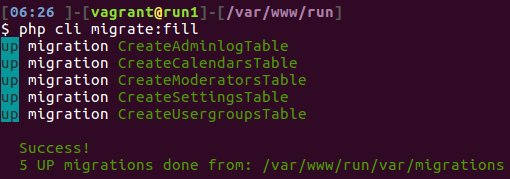
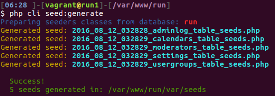

[![Latest Version on Packagist][ico-version]][link-packagist] [![Software License][ico-license]][link-license] [![Total Downloads][ico-downloads]][link-downloads]
#RunCli
Standalone command line interface.
    `migrate, seed, generate migrations and seeds from existing database, generate resources`

main objective was generate [Eloquent ORM](https://github.com/illuminate/database) migrations from existing database outside [Laravel](https://github.com/laravel/laravel) 
in my case [Eloquent ORM](https://github.com/illuminate/database) used with [Slim 3 Framework](https://github.com/slimphp/Slim)


## Install
* Via Composer, command line
``` bash
$ composer require runcmf/runcli
```
* Via composer.json
```
...
"require": {
    "runcmf/runcli":  "0.*"
  },
...
```
``` bash
$ composer update
```

* copy or `ln -s` cli to site_root

#Config:
script looking config in paths:
app/Config/Settings.php [runcmf/runcmf-skeleton](https://bitbucket.org/1f7/runcmf-skeleton.git)
app/settings.php [akrabat/slim3-skeleton](https://github.com/akrabat/slim3-skeleton)

config must contain [db] section.
for example:
``` php
return [
  'settings' => [
    'displayErrorDetails' => true,
    'determineRouteBeforeAppMiddleware' => true,
    'addContentLengthHeader' => false,
    'routerCacheFile' => DIR . 'var/cache/fastroute.cache',
    'db' => [// database configuration
      'driver'    => 'mysql',
      'engine'    => 'MyISAM',//InnoDB',
      'host'      => 'localhost',
      'database'  => 'run_test',
      'username'  => 'root',
      'password'  => '',
      'charset'   => 'utf8',
      'collation' => 'utf8_unicode_ci',
      'prefix'    => 'mybb_',
    ],
    ...
    ...
    ...
```

# Usage:
## Seed & Migrate
``` bash
php cli migrate:fill
```

``` bash
php cli seed:fill
```


## Generate migration from existing database:
> redone from [Xethron](https://github.com/Xethron/migrations-generator) but **without** Laravel, way/generators and doctrine/dbal 

``` bash
php cli migrate:generate
```

####*Generator info:*
> Now tested only MyISAM on mysqlnd 5.0.12-dev and as result: **NOT ready Foreign Keys**
> with time fix it :)

####Know problems:
```sql
`regip` varbinary(16) NOT NULL DEFAULT '',
`lastip` varbinary(16) NOT NULL DEFAULT '',

with keys
ADD KEY `regip` (`regip`),
ADD KEY `lastip` (`lastip`);
```
migrated to
```php
$table->binary('regip', 16)->default('')->index('regip');
$table->binary('lastip', 16)->default('')->index('lastip');
```
with migrate exception:
```bash
[Illuminate\Database\QueryException]                                                                                                                                                        
  SQLSTATE[42000]: Syntax error or access violation: 1170 BLOB/TEXT column 'regip' used in key specification without a key length (SQL: alter table `mybb_users` add index `regip`(`regip`))
```
solution 1:
if you want use binary(16): 
```php
comment index
$table->binary('regip', 16)->default('');//->index('regip');
$table->binary('lastip', 16)->default('');//->index('lastip');

and add in `up` section
DB::statement('CREATE INDEX regip_idx ON '.DB::getTablePrefix().'users (regip(16));');
DB::statement('CREATE INDEX lastip_idx ON '.DB::getTablePrefix().'users (lastip(16));');

and add in `down` section
DB::schema()->table('users', function($table) {
  $table->dropIndex('regip_idx');
});
DB::schema()->table('users', function($table) {
  $table->dropIndex('lastip_idx');
});
```
solution 2:
use [Eloquent ORM ipAddress](https://laravel.com/docs/master/migrations)
```php
$table->ipAddress('visitor');
```
solution 3:
http://stackoverflow.com/questions/17795517/laravel-4-saving-ip-address-to-model

and so on :)


## Generate seeds from existing database:
> redone from [orangehill/iseed](https://github.com/orangehill/iseed)

``` bash
php cli seed:generate
```


help soon...


### Who do I talk to? ###

* 1f7.wizard ( at ) gmail.com
* http://runcmf.ru

## License

Apache License
Version 2.0. Please see [License File](LICENSE.md) for more information.

[ico-version]: https://img.shields.io/packagist/v/runcmf/runcli.svg?style=flat-square
[ico-license]: https://img.shields.io/badge/license-Apache%202-green.svg?style=flat-square
[ico-downloads]: https://img.shields.io/packagist/dt/runcmf/runcli.svg?style=flat-square

[link-packagist]: https://packagist.org/packages/runcmf/runcli
[link-license]: http://www.apache.org/licenses/LICENSE-2.0
[link-downloads]: https://bitbucket.org/1f7/runcli
